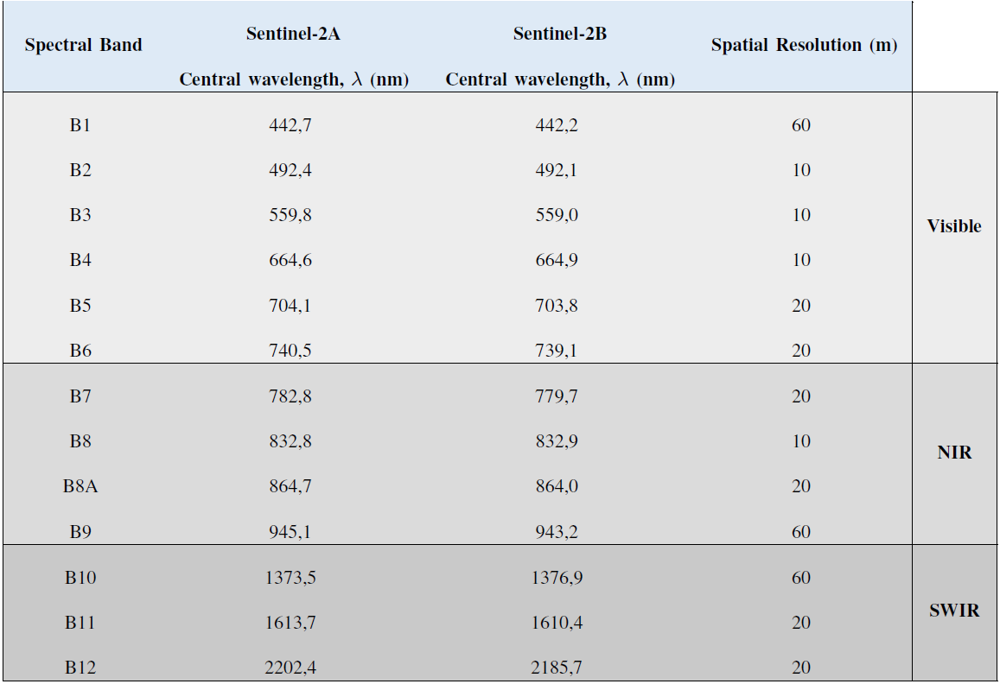
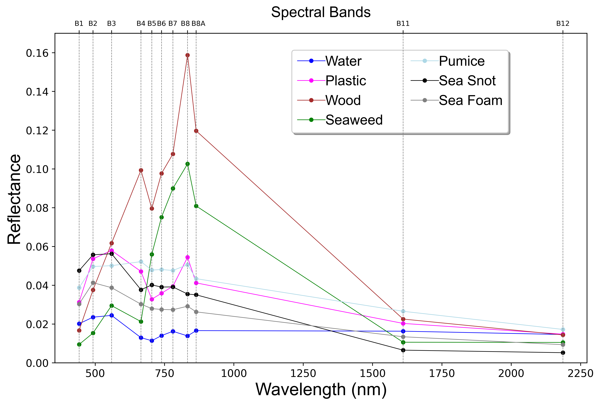
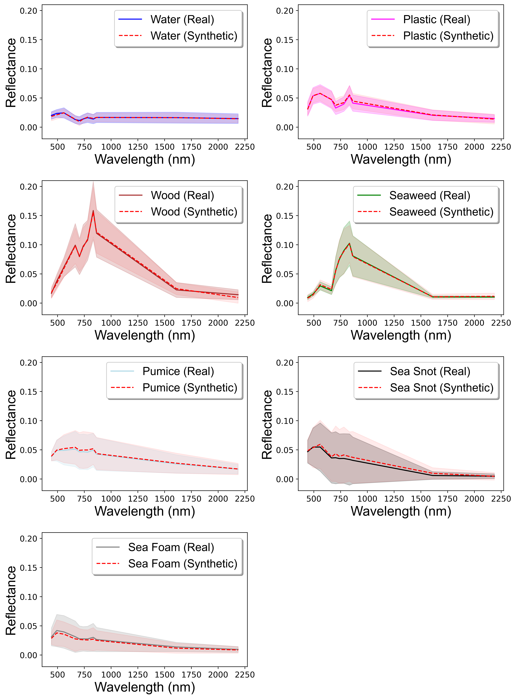

# [*Data*] Automatic Detection and Identification of Floating Marine Debris Using Multispectral Satellite Imagery

 Floating plastic debris that drift autonomously in our oceans are a significant environmental threat to marine life and ecosystems, making it crucial to develop and implement efficient tools to detect, capture, and eliminate such pollution from our oceans.

 Earth observation data have shown early promising results to detect marine plastic debris accumulations (e.g. <b>[1]</b>, <b>[2]</b>). Satellites are a reliable source of data due to their spatial and temporal resolution, extensive coverage, and efficiency in covering vast areas without human interaction. However, the automatic classification of floating plastic debris from satellite data is not simple, and supervised classification methods depend heavily on the availability of training samples.

 In this project, we collected data from literature, news articles, and social media posts resulting in <b>the most extensive freely available data set related to suspect floating plastic debris in satellite (Sentinel-2) imagery</b>. Besides suspect plastics and water data, we collected data from five other classes of floating debris: driftwood, seaweed, pumice, sea snot, and sea foam. Our findings indicate that plastic can be detected and differentiated from every other class in the data set.

## Purpose of This Repository

<em>This repository contains valuable satellite data on floating marine debris, and by sharing it, we hope to encourage the scientific community to make their data more accessible as well. With accessible data, we can work together to develop innovative solutions to tackle the pressing issue of marine debris in our oceans. Let's collaborate to make a positive impact on our environment.</em>

<em>Thank you for your interest in this project!</em>

Miguel M. Duarte and Leonardo Azevedo

## Citation

 M. M. Duarte and L. Azevedo, "Automatic Detection and Identification of Floating Marine Debris Using Multispectral Satellite Imagery," in IEEE Transactions on Geoscience and Remote Sensing, vol. 61, pp. 1-15, 2023, Art no. 2002315, doi: 10.1109/TGRS.2023.3283607.

## Table of contents
- [Satellite](#satellite)
- [Data Pre-processing](#data-pre-processing)
- [Data Overview](#data-overview)
	- [Water](#water)
	- [Plastic](#plastic)
	- [Driftwood](#driftwood)
	- [Seaweed](#seaweed)
	- [Sea Snot](#sea-snot)
	- [Sea Foam](#sea-foam)
- [Synthetic Data](#synthetic-data)
- [Data Sets](#data-sets)
- [Citation](#citation)
- [Acknowledgements](#acknowledgements)
- [License](#license)
- [References](#references)
	
## Satellite

 The study employs satellite data products from the Sentinel-2 mission, which consists of two identical satellites, Sentinel-2A and Sentinel-2B, developed and managed by the European Space Agency under the Copernicus Programme. These satellites offer <b>systematic coverage</b> of all coastal waters up to 20 km from the shore with a temporal resolution of 5 days at the equator and 2 to 3 days at mid-latitudes. Each satellite has a multi-spectral instrument that measures sunlight reflected from the Earth (i.e., works passively), providing <b>high spatial resolution</b> (10 m, 20 m, or 60 m, depending on the spectral band). The instrument's <b>radiometric resolution</b>, which determines its ability to distinguish differences in light intensity or reflectance, is essential for detecting floating plastic and ranges from 8 to 16 bits. Sentinel-2 has 13 spectral bands that cover the visible and near-infrared (NIR) to the short-wave infrared (SWIR), enabling a 12-bit radiometric resolution and allowing the image to be acquired over a range of 0 to 4095 potential light intensity values, as shown in Table 1. These features, coupled with their widespread use in studies aimed at detecting and monitoring floating debris, make <b>Sentinel-2 the ideal choice for acquiring multi-spectral floating plastic data</b>.

	

<b>Table 1:</b> Sentinel-2 spectral bands, central wavelengths and spatial resolutions.

	
## Data Pre-processing

 Satellite images require correction methods to remove the atmospheric contribution from the multi-spectral instrument's measurements, unlike UAV data where atmospheric effects are negligible due to the short path from the sensor to the observation sensor. To achieve atmospheric correction of the Sentinel-2 images, the study utilized the Dark Spectrum Fitting algorithm (DSF) from the Atmospheric Correction for OLI 'lite' (<b>ACOLITE</b>) v.20210802.0 software <b>[3]</b>. The DSF algorithm presumes the homogeneity of the atmosphere and the existence of dark pixels, which have close to zero surface reflectance in one or more of the sensor bands, in the scene. The spectral signature of these dark pixels, also known as the dark spectrum, is then used to select the best-fitting combination of spectral band and aerosol model for atmospheric correction. The parameters needed for "path-corrected" reflectance computation are then chosen from a look-up table, based on the selected combination. Due to low atmospheric transmittance, band 9 (B9) and band 10 (B10) are not included in the outputs.

## Data Overview
- #### Water

On a daily basis, the Sentinel-2 constellation captures millions of pixels of ocean water. For this study, 150 pixels of ocean water were selected from two distinct locations - the Caribbean Sea and the Gulf of Gera - over a period of fifteen days. Out of the 150 pixels, 121 were collected by Sentinel-2A and the remaining by Sentinel-2B. Furthermore, 30 pixels, which correspond to 25% of the water data, were collected from areas where the ocean floor is visible, resulting in brighter pixels. This observation suggests that different water depths correspond to different levels of spectral reflectance. Waters situated closer to the shoreline tend to be shallower, causing the ocean floor to reflect sunlight, whereas waters located further away from the shore tend to absorb most of the light. As depicted in Figure 1, this assumption is supported by the fact that shallower waters exhibit a higher level of reflectance across all spectral bands.

  

 <b> Figure 1:</b> Spectral reflectance of water pixels captured by the Sentinel-2, with varying depths, after atmospheric correction. The line represents the mean spectral reflectance, whereas the shaded area represents the standard deviation.

	

In general, the spectral responses of the water pixels are almost identical, except on the third band, where the reflectance of shallow water doubles that of deeper water. By comparing these responses with those presented in reference <b>[1]</b>, we can infer that the reflectance of shallow water is not significantly different from that of deeper water and is not high enough to be confused with other materials. Hence, there is no requirement for two separate categories, and all the data are grouped into a single class - water - with a spectral response depicted in Figure 2.

  

 <b> Figure 2:</b> Spectral reflectance of all water pixels captured by the Sentinel-2, after atmospheric correction. The line represents the mean spectral reflectance, whereas the shaded area represents the standard deviation.

- #### Plastic

 Data related to floating plastic debris are scarce. We gathered 206 pixels of suspect plastic that were previously reported by scientific reports, news articles or pictures on social media posts. Every pixel's spectral response was manually inspected and compared to the expected spectral signature in the literature <b>[1]</b>, <b>[4]</b>. We followed a conservative approach and data samples that did not meet the requirements were rejected and removed from the training data set. From the 206 pixels, 102 were taken from Sentinel-2A images and 107 from Sentinel-2B imagery.
Around 42% of the data, corresponding to 88 pixels, are from artificial plastic targets deployed in the ocean in the Gulf of Gera <b>[5]</b>, Tsamakia beach <b>[6]</b>, <b>[7]</b>, and Limassol <b>[8]</b>. The remaining 58% result from observations and reports of plastic floating in the marine environment. On the 23rd of April 2019, substantial quantities of plastic covered the Durban harbour, in South Africa, after a flood event. The debris eventually washed out to the sea, and a Sentinel-2 image from the following day allowed the detection of 72 pixels with spectral reflectance similar to plastic. The remaining pixels result from the work of Kikaki et al. <b>[9]</b> and their observations over the Bay Islands and Gulf of Honduras.
	

  

 <b> Figure 3: </b> Comparison between the spectral reflectance of all suspect plastic pixels and all water pixels captured by the Sentinel-2, after atmospheric correction. The line represents the mean spectral reflectance, whereas the shaded area represents the standard deviation.
	

 In our spectral library, the mean spectrum for plastic computed from the 206 individual pixels is characterized by two reflectance peaks, one centred at <b>B3</b> and the other at <b>B8</b>, and one absorption peak centred at the fifth Sentinel-2 spectral band (<b>B5</b>). Furthermore, these plastic-like debris have higher reflectance values in all spectral bands compared to the water spectral response.
	
- #### Driftwood

 Driftwood is wood that has been washed into the ocean through the action of natural occurrences such as winds or flooding, or because of logging. Its study is of great interest in many research fields. For example, in geomorphology, knowing the accumulation rates of wood in rivers may help in creating measures concerning the maintenance of watercourses and assist in risk management. However, it is challenging to find these pixels in Sentinel-2 images since it is not common to exist significant accumulations of driftwood. 
	

  

 <b> Figure 4: </b> Comparison between the spectral reflectance of all suspect plastic pixels and all driftwood pixels captured by the Sentinel-2, after atmospheric correction. The line represents the mean spectral reflectance, whereas the shaded area represents the standard deviation.
	

 PLP 2021 <b>[5]</b> allowed the collection of 62 pixels of driftwood on thirteen different days since they deployed a wooden target that simulates natural driftwood. Around 55% of these pixels were taken from Sentinel-2A images and the remaining from Sentinel-2B. Driftwood shows substantially more reflectance when compared to water or plastic, and it has two reflectance peaks in the fourth (<b>B4</b>) and eighth (<b>B8</b>) Sentinel-2 spectral bands.
	
- #### Seaweed

 Seaweed is the common name for countless species of marine plants and algae that grow in the ocean. There are several types of seaweed, but the most prevalent is the Sargassum or brown algae, which floats in large masses and even inspired the name of a region in the Atlantic Ocean, the Sargasso Sea. Its presence in the ocean is essential since it provides nutrients and shelter for many marine organisms, but too much seaweed can be harmful. Substantial accumulations of seaweed may block sunlight, preventing the seagrass below from growing and, when decomposing, its organic matter removes oxygen from the water. This work does not focus on differentiating the distinct species of seaweed, as its goal is to discriminate floating debris, and considerable variations in the various seaweed reflectance are not expected. One Sentinel-2B image from October 2018 was used to collect 150 pixels of seaweed in the coastal waters of Accra, Ghana. The seaweed's spectral signature coincides with the literature <b>[1]</b>, <b>[4]</b> since it presents a sharp increase in reflectance in the fourth Sentinel-2 spectral band (<b>B4</b>), followed by a fall in the band <b>8A</b>, being very distinct from the spectral responses of water, plastic and driftwood. Also, the standard deviation reveals that there is not much dispersion in the data relative to the mean before the reflection peak.
	

  

 <b> Figure 5: </b> Comparison between the spectral reflectance of all suspect plastic pixels and all seaweed pixels captured by the Sentinel-2, after atmospheric correction. The line represents the mean spectral reflectance, whereas the shaded area represents the standard deviation.
	

 
	
- #### Pumice

 Pumice is a light-coloured volcanic rock with a foamy appearance. It is formed when super-heated and highly pressurized molten rock, magma, is powerfully ejected from a volcano and rapidly cools down, which commonly happens in underwater eruptions. Pumice is so light that it may float on water for years, potentially forming gigantic floating islands (pumice rafts). These pumice rafts are considered a danger to navigation since they can cause damage to cargo vessels and mess up with radar signals. For example, tankers carry thousands of tonnes of oil and, if damaged from a collision, can provoke a massive environmental disaster. Hence, information on the location and course of pumice rafts can be valuable for the shipping industry.
	

  

 <b> Figure 6: </b> Comparison between the spectral reflectance of all suspect plastic pixels and all pumice pixels captured by the Sentinel-2, after atmospheric correction. The line represents the mean spectral reflectance, whereas the shaded area represents the standard deviation.
	

 In October 2021, a large underwater volcanic eruption spewed massive amounts of floating pumice stones that littered coastlines in Okinawa, Japan, damaging dozens of fishing vessels and forcing a large percentage to remain stuck at ports. A Sentinel-2A image from 26 October 2021 reveals thousands of bright pixels containing floating pumice stone and was used to collect 31098 pixels of this floating material. Pumice's reflectance values are close to the plastic mean spectral signature. However, plastic presents an absorption peak in the fifth spectral band (<b>B5</b>), which does not happen with pumice. Pumice's standard deviation reveals a lot of dispersion relative to the mean reflectance, which may be a consequence of different floating depths in different pixels. Pixels where pumice floats on the ocean's surface will have higher reflectance values than ones where pumice is slightly submerged.
	
- #### Sea Snot

 Marine mucilage, also known as sea snot, is a thick slimy organic substance that floats on the ocean. Its formation is linked to global warming and water pollution resulting from the discharge of industrial waste into the seas, which overloads algae with nutrients. Sea snot thrives in warmer and slower-moving waters, and its accumulation poses severe threats to public health due to the presence of bacteria and diseases, in addition to having adverse environmental and economic impacts. This substance negatively affects the fishing industry by clogging fishing nets, reducing oxygen levels in the water, and blocking sunlight, which kills marine life. Several outbreaks of sea snot have been reported in recent years, but none have reached the magnitude of the one in the Marmara Sea, Turkey, in 2021. Short-term countermeasures, such as laying barriers on the sea surface and collecting the substance, are available. Long-term countermeasures include enhancing wastewater treatment and imposing fines on companies that discharge industrial waste into the ocean.

	

  

 <b> Figure 7: </b> Spectral reflectances of sea snot and suspect plastic pixels, after atmospheric correction. The line represents the mean spectral reflectance, whereas the shaded area represents the standard deviation.
	

 One Sentinel-2B image from the Marmara Sea, on the 6th of June 2021, showed thousands of pixels containing sea snot. From those, 26403 pixels were selected. By examining Figure 7, it is clear why Hu et al. <b>[10]</b> concluded that remote differentiation of sea snots and marine debris using multi-band sensors is problematic. The two classes show a similar mean spectral reflectance, except in the eighth Sentinel-2 spectral band (<b>B8</b>), where plastics have a reflectance peak. In contrast to plastic, sea snot's standard deviation reveals a lot of dispersion, which probably results from different floating depths in different pixels, just like pumice.
	
- #### Sea Foam

 The model from Biermann et al. <b>[1]</b> showed some difficulties in distinguishing plastic from sea foam, bubbles, and froth, so this group of substances was included in this study. To examine the spectral behaviour of sea foam, a Sentinel-2A image from Vigo Ria in Galicia, Spain, was utilized, resulting in 2735 pixels. Sea foam's spectral response displays a small reflectance peak in the early spectral bands and another one in the eighth Sentinel-2 band (<b>B8</b>), similar to the mean spectral response of plastic. This similarity, coupled with the relatively high standard deviation, suggests that sea foam may be misidentified as plastic.
	

  

 <b> Figure 8:</b> Spectral reflectance of sea foam pixels, after atmospheric correction. The line represents the mean spectral reflectance, whereas the shaded area represents the standard deviation.
	
### Summary

Using data collected from common floating materials such as seaweed, sea foam, and driftwood, alongside substances that can cause harmful environmental effects, such as sea snot and pumice, it is possible to compare the spectral responses of all materials to plastic. Both driftwood and seaweed display a high level of reflectance in the eighth Sentinel-2 spectral band, enabling them to be distinguished from other materials. Additionally, driftwood exhibits a reflectance peak, whereas seaweed displays an absorption peak, making them distinguishable from each other as well. Water, due to its high heat capacity, has lower reflectance than all other classes. However, differentiating between plastic, pumice, sea snot, and sea foam based on spectral responses can be challenging. Therefore, utilizing spectral indices, which are mathematical equations that combine values from two or more wavelengths, enhances the spectral features that were not initially visible and is deemed appropriate.

	

  

 <b> Figure 9:</b> Mean spectral responses of all data, after atmospheric correction.
	
## Synthetic Data

 Although efforts have been made to gather public domain samples of different floating materials, the number of samples obtained is still relatively small for automatic classification algorithms. To overcome this limitation, data augmentation methods are typically applied. These methods allow classification models to learn from a range of data that could not be collected during the data acquisition stage, making them more resilient and reducing the time-consuming process of collecting and labelling data. However, in this study, minor alterations such as rotating, cropping, zooming, or grayscaling the original data are not feasible, and modifying the values of the spectral bands may result in spectral responses that do not represent any floating class. To address the lack of floating marine debris data, we used Wasserstein Generative Adversarial Networks (WGAN) <b>[11]</b> to generate <b>50,000 synthetic pixels from each class</b> that replicate the patterns and features of the actual data. This allowed us to investigate whether artificial data sets could serve as a solution to this issue.

<b>Figure 10:</b> Comparison between the mean values characterized by lines and the standard deviation represented by shaded areas of the spectral reflectance values from real and synthetic pixels produced using a WGAN (depicted in red).

## Data Sets

This repository contains 5 data sets:

- `all_data.csv`: contains all the pixels collected from all floating materials, resulting in a highly imbalanced dataset. The labels for this dataset are: 1 (water), 2 (plastic), 3 (driftwood), 4 (seaweed), 5 (pumice), 6 (sea snot), and 7 (sea foam).

- `balanced_data.csv`: contains data from all floating classes, but has been balanced to reduce class imbalance. The labels for this dataset are the same as in `all_data.csv`.

- `synthetic_data.csv`: contains 50,000 pixels from each class generated by a Wasserstein Generative Adversarial Network (WGAN). The labels for this dataset are the same as in `all_data.csv`.

- `train.csv`: contains the data that was used to train different machine learning models. The labels for this dataset are the same as in `all_data.csv`.

- `test.csv`: contains the data that was used to evaluate the performance of the trained models and select the best one. The labels for this dataset are the same as in `all_data.csv`.

Researchers can use these datasets to reproduce the experiments described in the paper or to develop new methods for detecting floating marine debris. Please refer to the paper for more information on the data collection and labeling process.

The `src` directory contains a function, `add_indices`, which is implemented in `indices.py` and receives a dataframe of Sentinel-2 pixels. The function returns all the spectral indices tested in this work. Researchers can use this function to calculate spectral indices for their own datasets and experiments.

## Acknowledgements

This work was supported by the AI Moonshot Challenge's first edition winner, project SMART, which was sponsored by the Portuguese Space Agency (PTSpace) in partnership with Fundação para a Ciência e Tecnologia (FCT), Unbabel, European Space Agency (ESA), Agência Nacional de Inovação (ANI), and Web Summit. Additionally, Leonardo Azevedo acknowledges the support provided by CERENA (strategic project FCT-UIDB/04028/2020).

## License

The data in this repository is distributed under the Creative Commons Attribution 4.0 International (CC-BY-4.0). See the LICENSE file for details.

 <i><b>Authors</b>: Miguel M. Duarte and Leonardo Azevedo.</i>
	
### References

 <b>[1]</b> L. Biermann, D. Clewley, V. Martinez-Vicente, and K. Topouzelis, “Finding Plastic Patches in Coastal Waters using Optical Satellite Data,” 
	Scientific Reports, vol. 10, p. 1–10, 2020.
	

 <b>[2]</b> B. Basu, S. Sannigrahi, A. Sarkar Basu, and F. Pilla, “Development of Novel Classification Algorithms for Detection of Floating Plastic Debris in Coastal Waterbodies Using Multispectral Sentinel-2 Remote Sensing Imagery,” Remote Sensing, vol. 13, no. 8, 2021.
	

 <b>[3]</b> Q. Vanhellemont, K. Ruddick, "Atmospheric correction of metre-scale optical satellite data for inland and coastal water applications," 
	Remote Sensing of Environment, vol. 216, pp. 586-597, 2018.
	

 <b>[4]</b> P. Tasseron, T. van Emmerik, J. Peller, L. Schreyers, and L. Biermann, "Advancing Floating Macroplastic Detection from Space Using Experimental Hyperspectral Imagery," Remote Sensing, vol. 13, no. 2335, 2021.

 <b>[5]</b> Marine Remote Sensing Group, "Plastic Litter Project 2021," http://plp.aegean.gr/plastic-litter-project-2021/.
	

 <b>[6]</b> K. Topouzelis, A. Papakonstantinou, and S. P. Garaba, "Detection of floating plastics from satellite and unmanned aerial systems (Plastic Litter Project 2018)," International Journal of Applied Earth Observation and Geoinformation, vol. 79, pp. 175-183, 2019.
	

 <b>[7]</b> K. Topouzelis, D. Papageorgiou, A. Karagaitanakis, A. Papakonstantinou, and M. Arias Ballesteros, "Remote Sensing of Sea Surface Artificial Floating Plastic Targets with Sentinel-2 and Unmanned Aerial Systems (Plastic Litter Project 2019)," Remote Sensing, vol. 12, no. 2013, 2020.
	

 <b>[8]</b> K. Themistocleous, C. Papoutsa, S. Michaelides, and D. Hadjimitsis, "Investigating Detection of Floating Plastic Litter from Space Using Sentinel-2 Imagery," Remote Sensing, vol. 12, no. 2648, 2020.
	

 <b>[9]</b> A. Kikaki, K. Karantzalos, C. A. Power, and D. E. Raitsos, "Remotely Sensing the Source and Transport of Marine Plastic Debris in Bay Islands of Honduras (Caribbean Sea)," Remote Sensing, vol. 12, no. 1727, 2020.
	

 <b>[10]</b> C. Hu, L. Qi, Y. Xie, S. Zhang, and B. B. Barnes, "Spectral characteristics of sea snot reflectance observed from satellites: Implications for remote sensing of marine debris," Remote Sensing of Environment, vol. 269, 2022.
	

 <b>[11]</b> M. Arjovsky, S. Chintala, and L. Bottou, “Wasserstein GAN,” 2017.
